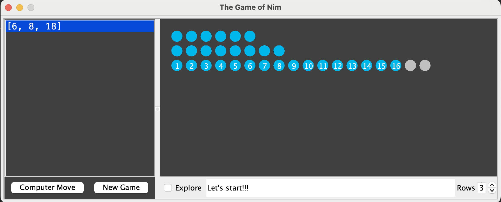

Java version of [cut-the-knot Nim](http://www.cut-the-knot.org/nim_st.shtml),
with some improvements:

* Two-player mode ("Explore mode")
* Play with more than three rows
* Undo

This is normal-play [Nim](https://en.wikipedia.org/wiki/Nim),
so your goal is to make the last move.

To run it, clone this repo and then enter the following in a terminal:

```bash
./gradlew run # or: ./gradlew jpackage
```

<p align="center"></p>
